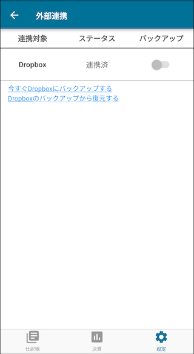

:toc: left
:toclevels: 5
:sectnums:
:toc-title: 目次

# 外部連携設定

現状では Dropbox との連携のみ対応しています。

## Dropbox

### 連携手順

. 設定 > 外部連携 > 未連携をクリック +

. Dropbox にログインする +

. まだ連携ユーザー数が少ないため、警告が表示される可能性があります +

. 権限を許可してください +

. アクセスコード生成完了画面が表示されます +

. 上記画面は自動で閉じ、ステータスが連携済みになります +

### トラブルシューティング

#### Dropbox に Google でログインしようとすると 403: disallowed_useragent が表示される

. 画面右上メニューで「外部ブラウザで開く」を選択してください。 +

#### アクセスコード生成完了画面が自動で閉じない

. 画面右上メニューで「認可コードを直接入力」を選択してください。 +

