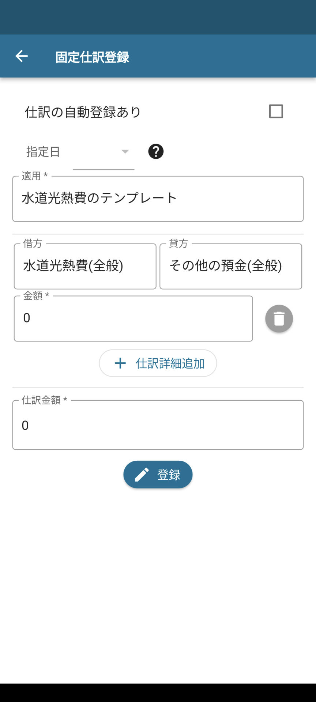
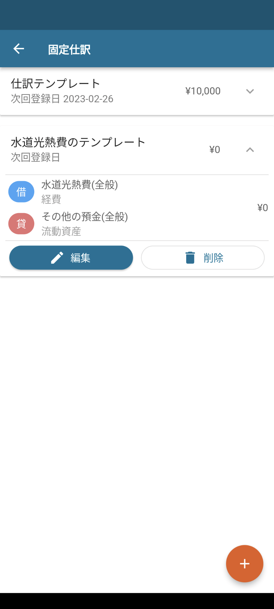
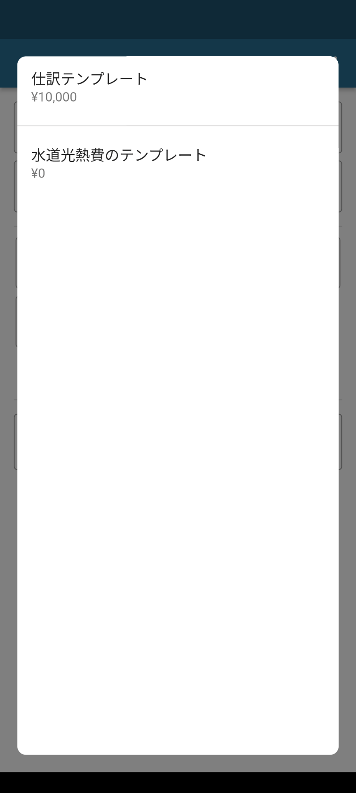
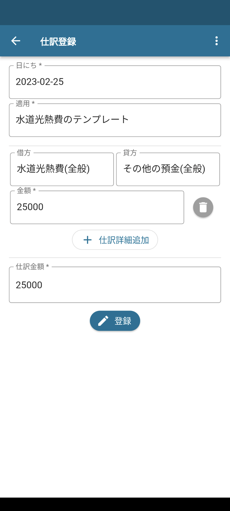
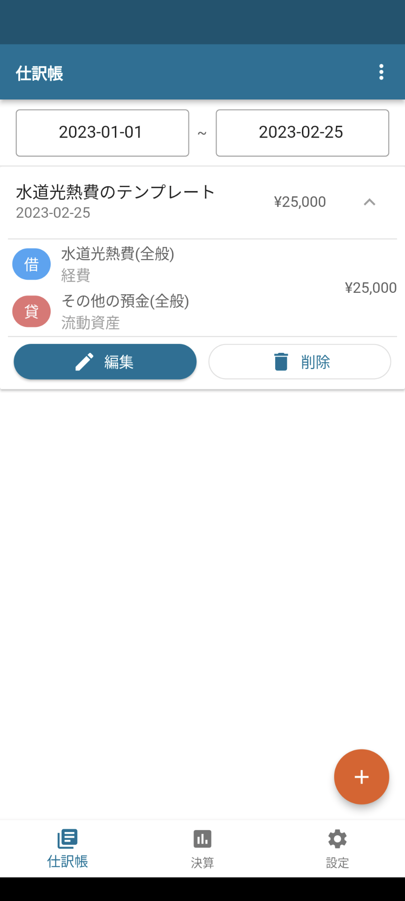
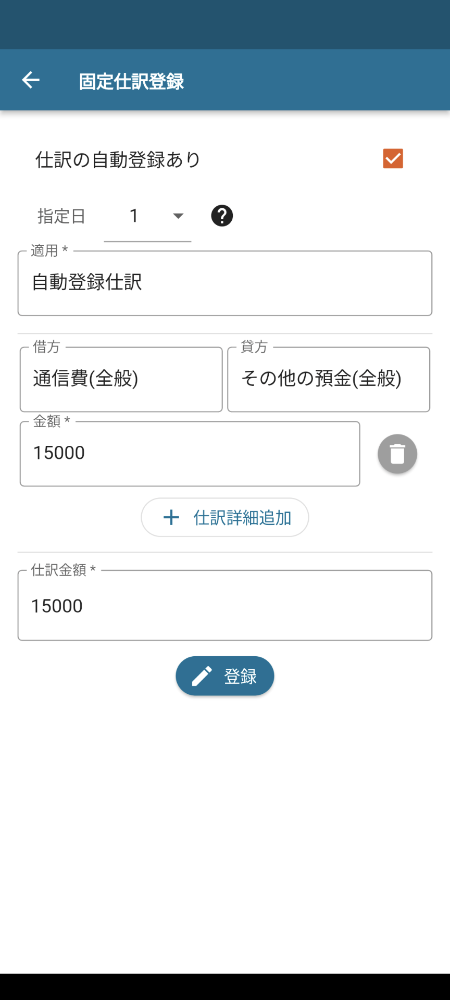
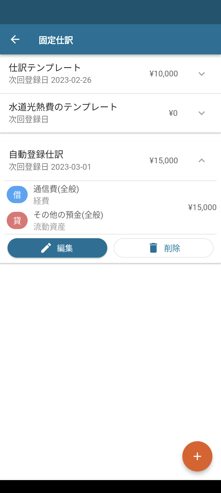

:toc: left
:toclevels: 5
:sectnums:
:toc-title: 目次

# 固定仕訳（定期仕訳）

## 概要

- 仕訳のテンプレートを作成して、金額だけを変更して仕訳を登録できるようにしたい
- 毎月、同じ仕訳を決まった日に自動登録したい

このような事が実現できる機能です。

## 詳細

### 固定仕訳

#### 固定仕訳登録

仕訳のテンプレートを作成します。

設定タブ -> 固定仕訳 -> プラスボタン　を選択します。

「仕訳の自動登録あり」チェックを外したまま登録することで、仕訳のひな型となるテンプレートを作成できます。

※仕訳金額が都度変わる場合は0円にしておくことも可能です。

#### 固定仕訳を利用した仕訳登録

通常の仕訳登録画面の右上メニュー「固定仕訳から選択」を選択します。

固定仕訳の内容が仕訳登録画面に反映されますので、金額などを修正して仕訳の登録が可能です。

### 定期仕訳

#### 定期仕訳登録

定期的に自動で登録される仕訳を作成します。

設定タブ -> 固定仕訳 -> プラスボタン　を選択します。

「仕訳の自動登録あり」チェックを付け、毎月の自動登録日を指定することで、自動登録される仕訳を作成できます。

※指定日を月の最終日としたい場合、31日を選択してください。

定期仕訳は、毎月の指定した日になったタイミングで自動的に仕訳が登録されます。

例：指定日を1日とした場合、毎月の1日0:00になったタイミングで新たな仕訳が登録。

仕訳金額が変わらず毎月登録が必要なものにご利用ください。
