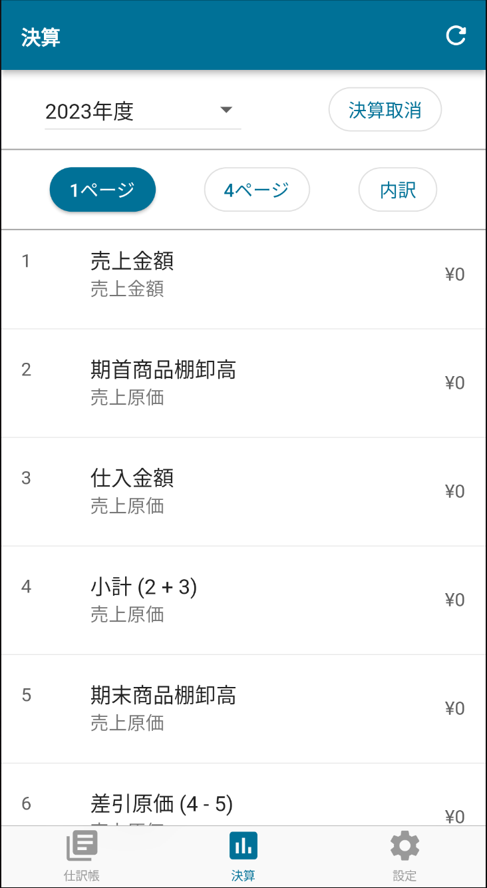
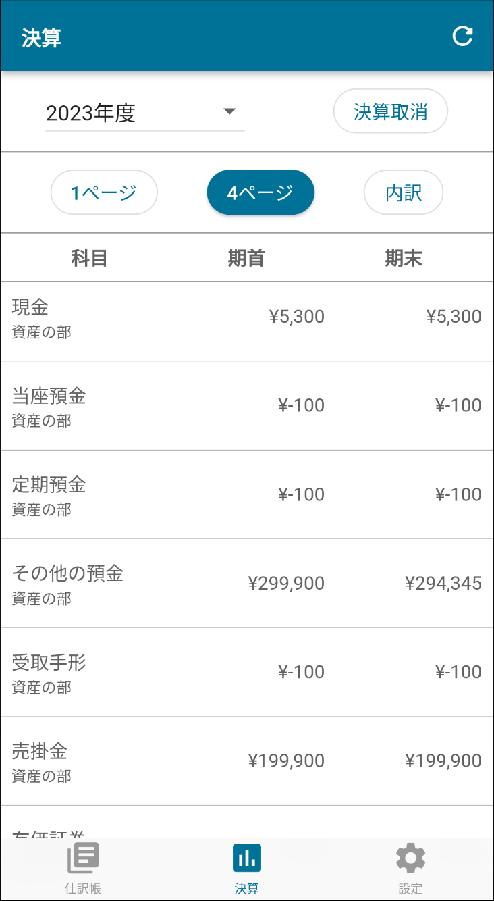

:toc: left
:toclevels: 5
:sectnums:
:toc-title: 目次

# 決算

## 概要

link:https://www.nta.go.jp/taxes/shiraberu/shinkoku/yoshiki/01/shinkokusho/pdf/r01/13.pdf[青色申告決算書] 1-4ページを作成します。

## 詳細

### 1ページ

青色申告決算書 1 ページ目に該当します。

[cols="1h,1d,1d,2d", options="header"] 
|===

|番号
|大分類
|小分類
|勘定科目

|１
|収益
|売上高
|全て

|２
|費用
|売上原価
|期首商品（製品）棚卸高

|３
|費用
|売上原価
|仕入高

|４
3+|２＋３

|５
|費用
|売上原価
|期末商品（製品）棚卸高

|６
3+|４−５

|７
3+|１−６

|８〜３１
|費用
|経費
|-

|３２
3+|８〜３１ の合計

|３３
3+|７−３２ の合計

|３４〜３７
3+|未対応 (0固定)

|３８
|費用
|専従者給与
|給与、賞与

|３９〜４２
3+|未対応 (0固定)

|４３
3+|３３−３８

|４４〜４５
3+|未対応

|===

### 4ページ

青色申告決算書 4 ページ目に該当します。

#### 資産の部

大分類：資産の勘定科目を科目ごとに合計します。

#### 負債・資本の部

大分類：負債、資本の勘定科目を科目ごとに合計します。

#### 原材料費・製造経費等

対応していません。

### 内訳

#### 月別売上

[cols="1h,1d,1d,1d", options="header"]
|===

|項目
|大分類
|小分類
|勘定科目

|１〜１２月売上
|収益
|売上高
|売上高

|１〜１２月仕入
|収益
|売上高
|仕入高

|家事消費等
|収益
|売上高
|家事消費等

|雑収入
|収益
|売上高
|雑収入

|軽減税率対象
3+|未対応

|===

#### 給与賃金

以下を詳細科目ごとに合計します。

- 費用 - 給与賃金 - 給与
- 費用 - 給与賃金 - 賞与

#### 専従者給与

以下を詳細科目ごとに合計します。

- 費用 - 専従者給与 - 給与
- 費用 - 専従者給与 - 賞与

#### 地代家賃

以下を詳細科目ごとに合計します。

- 費用 - 経費 - 地代家賃

## 開始残高の設定について

開始残高という勘定科目を用意しています。 +
この科目を用いて開始前年度の日付で仕訳登録後、開始前年度の決算を実行してください。

[cols="1d,1d,1d,1d,1d", options="header"]
.仕訳登録例
|===

|日付
|摘要
|借方
|金額
|貸方

|2022-12-31
|開始残高設定
|その他の預金
|10000
|開始残高

|===

